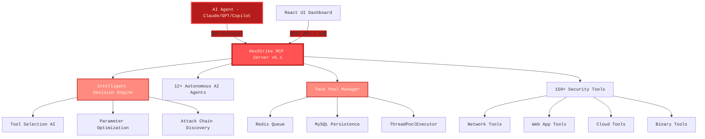

<div align="center">


# HexStrike AI MCP Agents v6.1
### AI-Powered MCP Cybersecurity Automation Platform

[](https://www.python.org/)
[](LICENSE)
[](https://github.com/0x4m4/hexstrike-ai)
[](https://github.com/0x4m4/hexstrike-ai)
[](https://github.com/0x4m4/hexstrike-ai/releases)
[](https://github.com/0x4m4/hexstrike-ai)
[](https://github.com/0x4m4/hexstrike-ai)
[](https://github.com/0x4m4/hexstrike-ai)

**Advanced AI-powered penetration testing MCP framework with 150+ security tools and 12+ autonomous AI agents**

[📋 What's New](#whats-new-in-v61) • [🏗️ Architecture](#architecture-overview) • [🚀 Installation](#installation) • [🛠️ Features](#features) • [🤖 AI Agents](#ai-agents) • [📡 API Reference](#api-reference)

</div>

---

<div align="center">

## Follow Our Social Accounts

<p align="center">
  <a href="https://discord.gg/BWnmrrSHbA">
    
  </a>
  &nbsp;&nbsp;
  <a href="https://www.linkedin.com/company/hexstrike-ai">
    
  </a>
</p>

</div>

---

## ✨ 工程化升级 (v6.1)

本次更新将单体脚本重构为**生产级企业架构**，直接部署于项目根目录：
- 🏗️ **扁平化结构**：Python 代码位于 `app/`，前端位于 `frontend/`，无冗余嵌套
- 📦 **任务池管理**：Redis 队列 + MySQL 持久化，支持优先级调度与实时进度
- 🔌 **MCP 协议原生支持**：标准 JSON-RPC 2.0 接口，无缝对接 Claude/Cursor
- 📊 **可视化监控**：ECharts 资源图表，SSE 流式日志控制台
- 🐳 **一键部署**：Docker Compose 编排，Nginx 反向代理

---

## 🏗️ Architecture Overview

HexStrike AI MCP v6.1 features a microservices-ready architecture with autonomous AI agents, intelligent decision-making, and vulnerability intelligence.



### How It Works

1. **AI Agent Connection** - Claude, GPT, or other MCP-compatible agents connect via JSON-RPC 2.0
2. **Intelligent Analysis** - Decision engine analyzes targets and selects optimal testing strategies
3. **Task Scheduling** - Tasks queued in Redis, executed by ThreadPoolExecutor
4. **Real-time Monitoring** - SSE streams logs and progress to React Dashboard
5. **Advanced Reporting** - Visual output with vulnerability cards and risk analysis

---

## 🚀 Installation

### 1. Docker 部署 (推荐)
```bash
# 启动所有服务 (MySQL + Redis + Backend + Frontend)
docker-compose up -d

# 查看日志
docker-compose logs -f backend
```
访问：
- 前端 UI: `http://localhost`
- MCP 端点: `http://localhost:8888/mcp`

### 2. 本地开发
```bash
# 后端
pip install -r requirements.txt
python run.py

# 前端
cd frontend
npm install
npm run dev
```

### 3. 初始化工具库
```bash
python scripts/seed_tools.py
```

### 4. 安装安全工具 (Linux)
**Core Tools (Essential):**
```bash
# Network & Reconnaissance
nmap masscan rustscan amass subfinder nuclei fierce dnsenum
autorecon theharvester responder netexec enum4linux-ng

# Web Application Security
gobuster feroxbuster dirsearch ffuf dirb httpx katana
nikto sqlmap wpscan arjun paramspider dalfox wafw00f
```

---

## 📖 API Reference

### MCP 调用示例
```json
POST /mcp
{
  "jsonrpc": "2.0",
  "id": "1",
  "method": "tools/call",
  "params": {
    "name": "nmap",
    "arguments": { "target": "192.168.1.100", "ports": "80,443" }
  }
}
```

### REST API 端点
| Endpoint | Method | Description |
|----------|--------|-------------|
| `/api/tools/` | GET | 获取工具列表 |
| `/api/tools/<name>/health` | POST | 触发工具健康检查 |
| `/api/tasks/` | POST | 提交新任务 |
| `/api/tasks/` | GET | 查询任务池 |
| `/api/tasks/<id>` | GET | 获取任务详情 |
| `/api/monitor/stats` | GET | 获取系统资源指标 |
| `/api/monitor/logs/<id>/stream` | GET | SSE 实时日志流 |

---

## 📁 项目结构
```
hexstrike-ai/
├── app/                # [NEW] Flask 核心代码 (替代 backend/)
│   ├── __init__.py
│   ├── config.py
│   ├── extensions.py
│   ├── models/
│   ├── routes/
│   ├── services/
│   └── stores/
├── frontend/           # React 前端
│   ├── src/
│   ├── package.json
│   └── vite.config.ts
├── scripts/            # 初始化脚本
├── run.py              # 启动入口
├── gunicorn.conf.py    # 生产配置
├── requirements.txt
├── docker-compose.yml
├── Dockerfile.backend
├── Dockerfile.frontend
├── nginx.conf
├── hexstrike_mcp.py    # [保留] 原文件
└── hexstrike-ai-mcp.json # [保留] 原文件
```

---

## 🔒 安全提示
本项目仅供授权的安全测试与学习使用。请勿用于非法用途。
